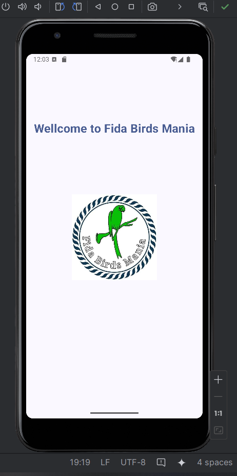
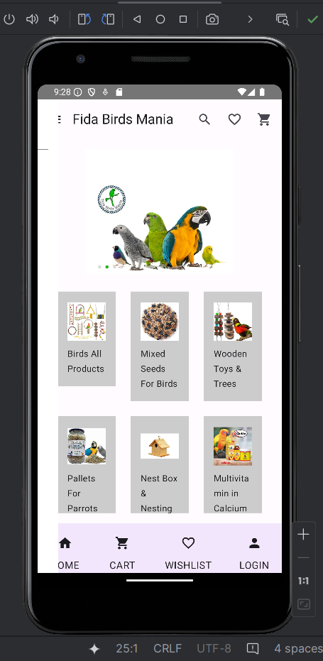
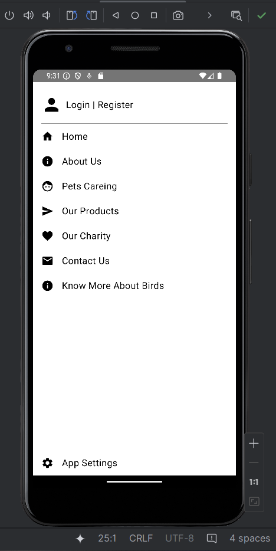
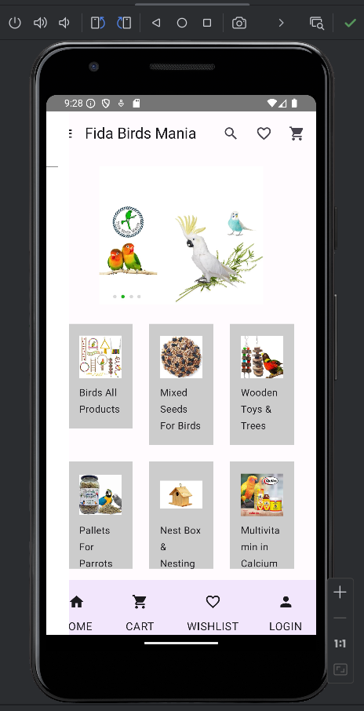
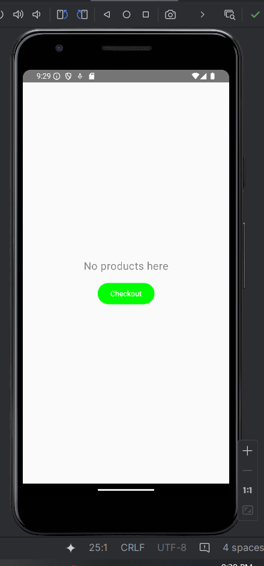
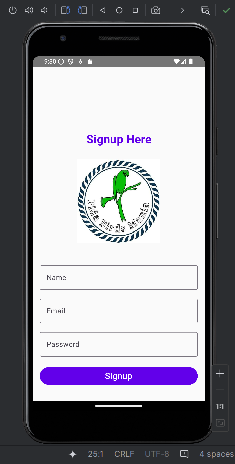
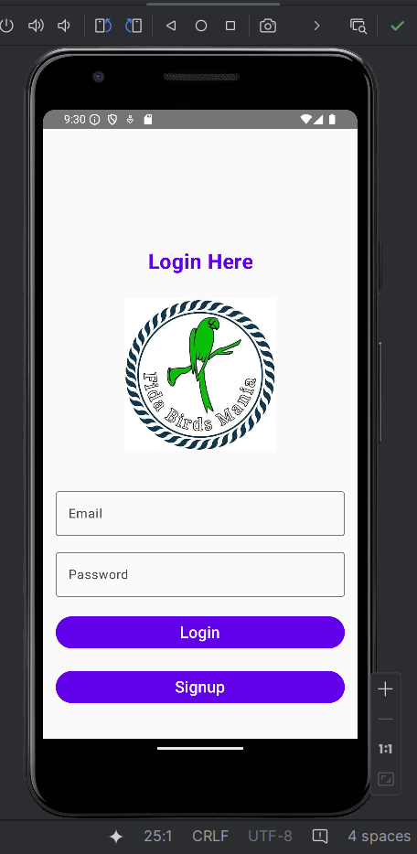

# Fida Birds Mania

Fida Birds Mania is a mobile application designed to cater to bird enthusiasts by providing an easy and efficient way to browse, search, and purchase bird accessories. The app leverages modern Android development practices, using Kotlin and Jetpack Compose, to deliver a seamless user experience.

---

## Project Overview

### Introduction

Fida Birds Mania is your one-stop shop for bird accessories. Whether you’re looking to add something new to your bird’s collection or searching for the perfect gift, this app has it all. Built with a clean architecture using the MVVM (Model-View-ViewModel) pattern, the app ensures scalability and maintainability. The app integrates Room Database for efficient data management and supports various features like search, favorites, and detailed product views.

---

### Features

- **Browse Accessories**: Explore a wide range of bird accessories with ease.
- **Detailed View**: Get in-depth information about each accessory, including images, descriptions, and prices.
- **Add to Cart**: Seamlessly add items to your shopping cart for purchase.
- **Purchase**: Complete your purchase with a few clicks.
- **Search Functionality**: Quickly find accessories by name or category.
- **Favorites**: Mark accessories as favorites for easy access later.

---

### Architecture

The app follows the MVVM architecture, ensuring a clean separation of concerns:

- **Model**: Handles the data layer, including Room Database and data classes.
- **View**: Composables that render the UI.
- **ViewModel**: Manages UI-related data, ensuring it survives configuration changes and is lifecycle-aware.

---

### Setup and Installation

1. **Clone the Repository**:
   ```bash
   git clone https://github.com/your-repo/FidaBirdsMania.git
   cd FidaBirdsMania
   ```

2. **Open in Android Studio**:
   - Launch Android Studio.
   - Choose "Open an existing Android Studio project."
   - Navigate to the cloned repository and select it.

3. **Build the Project**:
   - Ensure Android Studio and required SDKs are up-to-date.
   - Build the project to resolve dependencies.

4. **Run the App**:
   - Choose a device or emulator.
   - Click the "Run" button.

---

### Database Schema

The Room Database schema for the app includes:

- **Accessory Table**:
  - `id`: Int (Primary Key)
  - `name`: String
  - `description`: String
  - `price`: Float
  - `image_url`: String
  - `category`: String

---

### UI Components

- **MainActivity**: Sets up the navigation host and provides dependencies to composables.
- **Composables**:
  - **AccessoryListScreen**: Displays a list of accessories.
  - **AccessoryDetailScreen**: Shows detailed information about a selected accessory.
  - **CartScreen**: Displays the items in the cart.
  - **FavoriteScreen**: Displays the user's favorite accessories.
  - **SearchScreen**: Allows searching for accessories.

---

### Screenshots

Below are some screenshots of the Fida Birds Mania app interface. These images showcase the user-friendly design and functionality of the application.

**Splash Screen**


**Home Screen**


**Menu List**


**Accessory Detail**


**Cart**


**Login Screen**


**Signup Screen**


---

### Code Overview

- **MainActivity**: The entry point of the application.
- **Navigation**: Handled using Jetpack Compose’s navigation component.
- **Repository**: Manages data operations, abstracts data sources.
- **ViewModel**: Manages UI-related data and exposes it to the UI layer.
- **Composables**: Responsible for rendering UI components.

---

### Conclusion

Fida Birds Mania provides a seamless and user-friendly platform for purchasing bird accessories. Built with Kotlin, Jetpack Compose, and Room Database, the app ensures efficient and enjoyable user experiences. 

For future enhancements, features like user authentication, accessory reviews, and ratings can be added.

---

